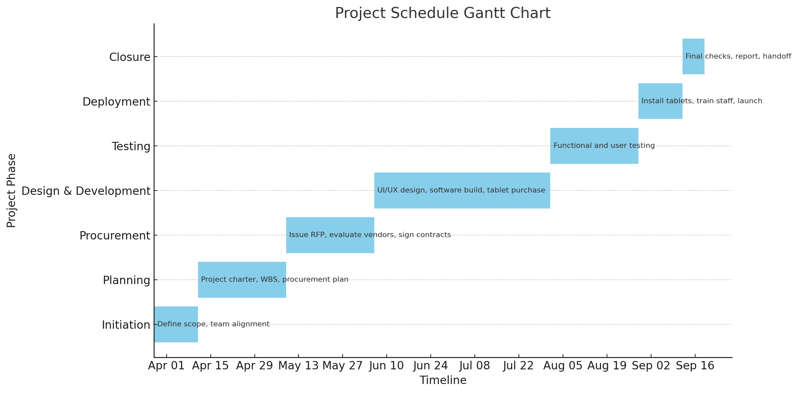
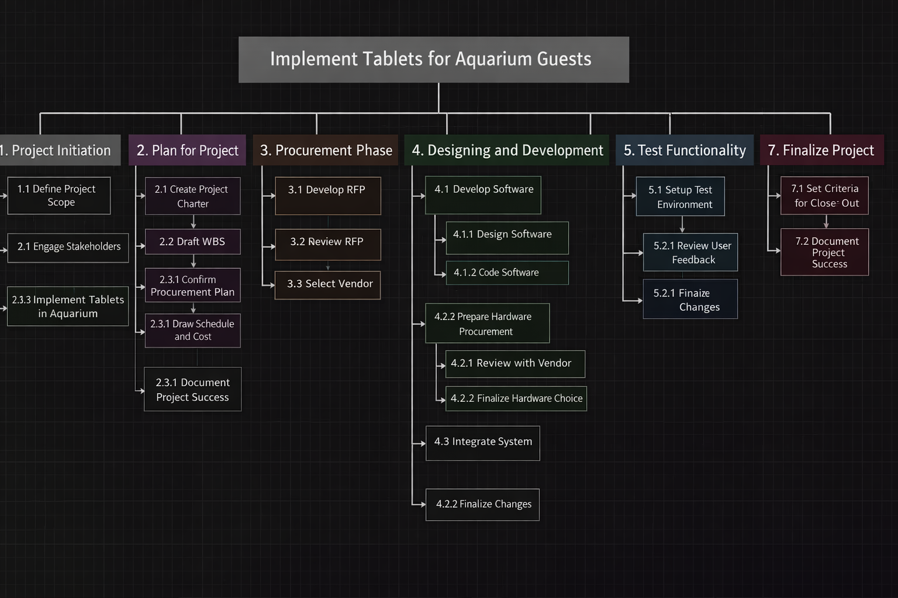
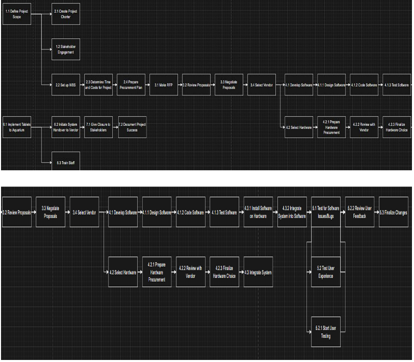

# 🏗️ Smart Aquarium System Architecture Project

## 📌 Overview

This project presents a comprehensive system design and project plan for implementing a **smart tablet solution** at the National Aquarium in Baltimore. The goal is to enhance visitor experience by providing real-time, interactive access to exhibit information, navigation, and educational content.

The project follows the **Systems Development Life Cycle (SDLC)**, covering planning, procurement, system design, scheduling, and deployment strategy.

---

## 🎯 Objectives

* Improve visitor engagement through interactive technology
* Provide real-time information about animals, exhibits, and facilities
* Enable easy navigation within the aquarium
* Integrate with existing educational and retail databases
* Deliver a scalable and user-friendly system

---

## 🛠️ My Contributions

* Developed a **25-week project schedule** covering all SDLC phases
* Created a **Responsibility Matrix (RACI)** to define team roles
* Planned **resource allocation** (hardware, software, personnel)
* Contributed to **deployment strategy and staff training planning**
* Supported **system integration planning** with existing databases

---

## 🧠 Key Concepts & Skills

* Systems Development Life Cycle (SDLC)
* Project Planning & Scheduling
* Work Breakdown Structure (WBS)
* Gantt Chart & Timeline Analysis
* Resource Management
* Procurement & Vendor Selection
* System Integration

---

## 📊 Project Timeline (Gantt Chart)

This Gantt chart represents a 25-week project timeline, covering key phases from initiation to project closure.

**Key Insight:**
The critical path flows through **design & development, testing, and deployment**, meaning delays in these stages directly impact project completion.

---

## 🧩 Work Breakdown Structure (WBS)

The Work Breakdown Structure divides the project into smaller, manageable components, ensuring clear organization and task tracking.

---

## 🔗 Network Diagram

The network diagram illustrates task dependencies and sequencing across all project phases.

---

### 📅 Project Schedule

The project follows a structured 25-week timeline across all SDLC phases:

| Phase                | Tasks                                         | Duration | Time Frame      |
| -------------------- | --------------------------------------------- | -------- | --------------- |
| Initiation           | Define scope, team alignment                  | 14 days  | Mar 28 – Apr 11 |
| Planning             | Project charter, WBS, procurement plan        | 28 days  | Apr 11 – May 09 |
| Procurement          | Issue RFP, evaluate vendors, sign contracts   | 28 days  | May 09 – Jun 06 |
| Design & Development | UI/UX design, software build, tablet purchase | 56 days  | Jun 06 – Aug 01 |
| Testing              | Functional and user testing                   | 28 days  | Aug 01 – Aug 29 |
| Deployment           | Install tablets, train staff, launch          | 14 days  | Aug 29 – Sep 12 |
| Closure              | Final checks, report, handoff                 | 7 days   | Sep 12 – Sep 19 |

---

### 💰 Project Cost Summary

| Activity                           | Estimated Cost    |
| ---------------------------------- | ----------------- |
| Hardware (250 tablets @ $300 each) | $75,000           |
| Software Development               | $50,000           |
| System Integration                 | $20,000           |
| Testing & Quality Assurance        | $5,000            |
| Staff Training                     | $3,000            |
| Project Management                 | $7,000            |
| Contingency                        | $10,000           |
| **Total Estimated Cost**           | **$120K – $170K** |

**Key Insight:**
The project budget is primarily driven by hardware procurement and software development, which together account for the majority of total costs.

---

### 👥 Responsibility Matrix (RACI)

The Responsibility Matrix defines ownership and accountability for each major task in the project.

| Task                          | Project Manager (Femi) | Procurement (Onyinyechi) | Tech Lead (Assam) | Scheduling (Niranjan) | Cost/Close-Out (Adamah) |
| ----------------------------- | ---------------------- | ------------------------ | ----------------- | --------------------- | ----------------------- |
| Define Scope                  | A                      | I                        | R                 | C                     | I                       |
| Develop RFP                   | I                      | A/R                      | C                 | I                     | I                       |
| Vendor Selection              | C                      | A/R                      | C                 | C                     | I                       |
| Project Planning              | A                      | C                        | R                 | R                     | I                       |
| Software/Hardware Integration | I                      | C                        | A/R               | C                     | I                       |
| Schedule Development          | I                      | I                        | C                 | A/R                   | I                       |
| Cost Estimation               | I                      | I                        | C                 | C                     | A/R                     |
| Testing and QA                | A                      | C                        | R                 | C                     | I                       |
| Deployment                    | A                      | C                        | R                 | R                     | C                       |
| Training                      | A                      | C                        | C                 | R                     | I                       |
| Project Closure               | I                      | I                        | I                 | C                     | A/R                     |

**R = Responsible | A = Accountable | C = Consulted | I = Informed**

**Key Insight:**
Using a RACI matrix ensured clear task ownership, improved communication, and reduced ambiguity across the project team.

---

## 🔄 System Features

* Voice-enabled and multilingual interaction
* Real-time access to aquarium database
* Interactive maps and navigation
* Educational content (text, images, video)
* Integration with retail system for recommendations

---

## 🏗️ Project Phases (SDLC)

1. **Initiation** – Define scope and align stakeholders
2. **Planning** – Develop charter, WBS, and procurement plan
3. **Procurement** – Issue RFP and select vendors
4. **Design & Development** – Build software and procure hardware
5. **Testing** – Functional and user testing
6. **Deployment** – Install tablets and train staff
7. **Closure** – Final reporting and system handover

---

## 📄 Project Deliverables

* Full Project Report
* PowerPoint Presentation
* Gantt Chart
* Work Breakdown Structure
* Network Diagram
* Responsibility Matrix

---

## 🔗 Project Files

* 📄 [Full Report](docs/system_architecture_report.pdf)
* 📊 [Presentation Slides](docs/system_architecture_project.pptx)

---

## 🚀 Key Takeaways

This project demonstrates the ability to:

* Plan and manage a large-scale system implementation
* Apply SDLC principles to real-world problems
* Coordinate resources, timelines, and stakeholders
* Design structured and scalable system solutions

---

## 👤 Author

**Niranjan K C**
- Information Technology | Data Analytics
- Towson University (May 2026)
---
